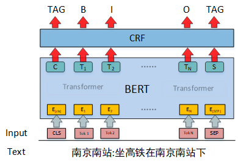
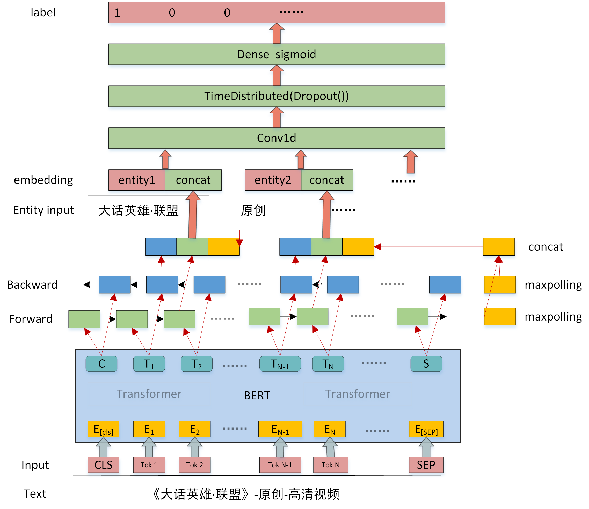
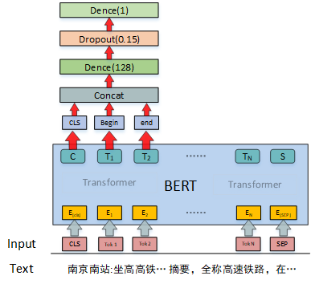

### <center>**CCKS&百度 2019中文短文本的实体链指**

<center>队名：FREE  


**摘要**

　　传统的实体链指任务主要是针对长文档，长文档拥有充分的上下文信息能够辅助实体的识别与消歧，相比之下，中文短文本的实体链指存在很大的挑战。本任务是面向中文短文本的实体识别与链指，即对于给定的一个中文短文本识别出其中的实体，并与给定知识库中的对应实体进行关联。实体链接整个过程包括实体识别和实体消歧两个子任务。对于实体识别这一子任务，现有的方法较多使用命名实体识别（LSTM+CRF）的方案，使用这种方案不能利用到知识库的信息。在此我们提出了结合知识库的一种实体识别方法。首先通过知识库的中实体以及实体的描述文本得到实体词典和实体嵌入，然后通过匹配方式，匹配得到短文本中的所有可能实体，在通过BERT-GRU提取相关特征，与该实体嵌入进行比较，通过二分类方式进行实体识别。结果显示这种方案融合命名实体识别方案，对最终结果有很大提升。对于实体消歧这一子任务，我们将这一任务视为二分类的问题，通过二分类模型对候选实体进行预测，然后对概率排序完成消歧任务。为了充分的提取短文本的信息，二分类模型选择基于BERT二分类模型。在最终的模型评比中，我们方案获得了最好的成绩。

**关键词**

　　实体链接，实体识别，实体消歧，二分类，BERT，实体嵌入

**1** **数据分析与处理**

　　此部分是通过分析数据的特点然后做一些数据的预处理，方便以后的使用。

**1.1 引入新的别名**

　　经过对数据集统计分析，训练集中有2.592%的实体名在实体库中无法匹配，部分错误样例如下所示：

1. 安妮•海瑟薇：文本中间有特殊符号
2. 新浪微薄：输入文本中实体名错误
3. 下载,：实体名标注错误，引入了符号
4. 国家质检总局: 别名不在知识库中

　　 为了解决这个问题我们通过为知识库中的对应实体引入新的别名来改善这一问题，具体步骤如下：

1. 对于错误１，对特殊符号进行归一化处理，并将处理后的名字，加入到对应实体的别名中。如所有中文标点符号全部准换成英文标点符号。

2. 对于错误３，我们实体识别的模型能够解决这一问题

3. 针对错误２与错误４，我们统计知识库中实体（E）无法匹配总次数（E_num）,训练集中实体E无法匹配的所有字符串（M1、M2、M3...Mi）以及它们出现的次数（Mi_num...）。如果E_num >4 ,并且Mi_num>3 则将字符串M加入到实体E的别名中。如，针对知识库中实体 bilibili 统计信息如下：

   ```python
   'bilibili':{'E_num': 108, '哔哩哔哩': 94, '哔哩哔哩弹幕视频网': 5, '异地恋': 1, 'b站': 8}
   ```

   根据以上统计将 '哔哩哔哩' ，'哔哩哔哩弹幕视频网'，'b站' 加入到实体 bilibili 的别名中。

**1.2  实体描述文本的构建**

　　知识库中每个实体都有‘data’ 字段，‘data’ 字段包含多个predicate项和object项，数据格式如下：

```json
    "subject_id": "10001"
    "subject": "胜利",
    "data": [
        {"predicate": "摘要", "object": "英雄联盟胜利系列皮肤是拳头公司制作的具有纪念意义限定系列皮肤之一。拳头公司制作的具有纪念意义限定系列皮肤还包括英雄联盟冠军系列皮肤。..."}, 
        {"predicate": "制作方", "object": "Riot Games"}, 
        {"predicate": "外文名", "object": "Victorious"},
        {"predicate": "来源", "object": "英雄联盟"}, 
        {"predicate": "中文名", "object": "胜利"}, 
        {"predicate": "属性", "object": "虚拟"}, 
        {"predicate": "义项描述", "object": "游戏《英雄联盟》胜利系列限定皮肤"}]
```

　　将所有的 predicate和object 相连得到实体描述文本。

```json
{"10001": "摘要：英雄联盟胜利系列皮肤是拳头公司制作的具有纪念意义限定系列皮肤之一。...,制作方:Riot Games,外文名:Victorious,来源:英雄联盟,中文名:胜利" }
```

　　连接后的描述文本长度分布如下：


　　通过分析可以发现文本会存在过长的情况，为了方便以后处理需要多过长的文本进行截断，截断规则如下：

1. predicate项+object项 的长度小于30 不在截断

2. predicate项+object项 的长度大于30按比例截断


**1.3 其他处理**

 　　为了方便后续模型的使用我们需要根据知识库数据，构建一些字典。有以下几个字典：

1. entity_id 字典   key：实体名字 value：kb_id 列表

   ```python
   {'胜利': ['10001', '19044', '37234', '38870', '40008', '85426', '86532', '140750']}
   ```

   其中 胜利 为实体名字，列表里面为名字为 胜利 的所有实体的id。

2.  id_entity字典  key: kb_id  value: subject字段(实体名字)

   ```python
   {'10001': '胜利'}
   ```

3. id_text字典 key：kb_id   value: 实体描述文本

   ```python
   {'10001': '摘要:英雄联盟胜利系列皮肤是拳头公司制作的具有纪念意义限定系列皮肤之一。'}
   ```

   描述文本采用1.2 中的逻辑进行构建

4. id_type字典  key：kb_id    value: entity type

   ```python
   {'10001': ['Thing']}
   ```

5.  type_index字典 key：type name value：index

   ```python
   {
       ‘NAN’: 0
       'Thing':1
   }
   ```

**2 实体识别**

 　　实体识别采用两个模型，第一个按照命名实体识别方式去做，直接采用BERT+CRF。针对基于实体库实体链接（尤其是短文本）仅仅采用BERT+CRF进行实体识别有两点不足：

1. BERT+CRF仍然会造成实体边界错误
2. BERT+CRF模型识别实体不全
3. 没有利用到知识库的信息

为了解决上述两个不足，并且能够完全利用知识库里面的实体信息，于是决定使用知识库里面的实体并通过匹配的方式来解决上述问题。但是如果直接全部匹配并且不加筛选，仍然有以下不足之处：

1. 匹配到的实体太多，导致准确率迅速下降，严重影响后续消歧模型的精度
2. 仅仅用到了知识库的实体名字，没有用到其他信息，并不能完全利用知识库的信息

为了能够利用到知识库全部信息，并且能够对匹配到的实体加以筛选，我们构建了一个二分类模型对匹配到的实体进行筛选。

**2.1 BERT+CRF**

 　　针对BERT+CRF模型我们没有进行太多的操作，直接在BERT的输出后面接CRF，模型图以及对应参数如下：



参数:

-- max_len 52

--batch_size 64

--dropout 0.2 （bert 输出后接的dropout）

--num_epochs 7

一些训练细节：

1. 采用BIO标记，BERT的CLS和SEP位置用 TAG 标记
2. 将训练集分为9份，采用9折交叉验证，分别按照loss和f1保存模型，共18个模型
3. 因为bert具有一定的随机性，在训练的过程中针对每个模型会多训练几次选择较好的一个（从第一轮结束验证后就能判断，不用全部跑完）说明：：接下来所有涉及bert的模型我们都采用了这种方式训练
4. 前3轮学习率为1e-5，后面会调整为1e-6
5. 最大epoch为7，训练过程会根据loss提前停止

**2.2 匹配二分类模型**

　　这部分比较复杂，不太好叙述，下面按照具体实现过程进行讲解。

2.2.1 字典树+实体正向最大匹配

　　为了加快速度采用字典树这一结构，同时采用正向最大匹配实体的思路，去匹配文本中实体。首先需要的数据为1.3中的 entity_id 字典，将里面的key 也就是实体名字插入到字典树中，实体库中存在很多单字实体，这类实体匹配会造成太多匹配结果，对于单字实体不在插入。

全部匹配例：

```python
text：《大话英雄·联盟》-原创-高清视频
result： [('大话英雄·联盟', 1), ('联盟', 6), ('原创', 10), ('高清视频', 13), ('视频', 15)]
```

最大匹配例：

```python
text：《大话英雄·联盟》-原创-高清视频
result： [('大话英雄·联盟', 1), ('原创', 10), ('高清视频', 13)]
```

正确结果：

```python
text：《大话英雄·联盟》-原创-高清视频
result： [('大话英雄·联盟', 1), ('视频', 15)]
```

　　通过经过统计发现，采用最大匹配对整体数据效果较好，但是在实验过程中发现，最大匹配时会出现一些实体重复，如 迅雷、下载 和 迅雷下载三个实体，还有 视频 和 高清视频两个个实体，如果不处理最大匹配时将会漏掉 迅雷、下载 两个实体，仅仅会匹配 迅雷下载 这一个实体。为处理这种情况，统计他们出现的次数并根据出现次数来决定这类实体该怎么处理。处理分一下三种情况：

      1. 仅保留最大的实体，如迅雷下载开，
      2. 保留小的实体具体保留那个看统计数据 如 迅雷
      3. 都保留 如 迅雷 下载 迅雷下载

代码实现依然安装最大匹配去实现，只是针对要分开的实体，在匹配结束后再分开。

2.2.2 实体名字嵌入

　　为了能够对匹配到的实体进行二分类，我们需要将实体名字用一个向量表示，当然实体名字嵌入向量可以随机生成最后通过训练也能不断拟合，但是一个好的初始化向量对结果影响很大，也因为后续二分类模型用到了BERT，这里我们使用BERT来得到实体名字的嵌入。具体思路和过程如下：

1. 将每个实体文本描述输入到BERT模型，则 [CLS] 位置的输出向量可以这个实体的意思。于是我们能够得到每个实体对应的向量，代码中我们用一个字典表示 id_embedding key：subject_id， value：CLS 输出向量

2. 对于实体名字只对应一个实体的情况，则直接用实体对应向量当做这个实体名字的嵌入。如

   ```python
   {'无尽武道': ['10007']}
   ```

3. 对于实体名字只对应多个实体的情况，求平均，如

   ```python
   {'胜利': ['10001', '19044', '37234', '38870', '40008', '85426', '86532', '140750']}
   ```

通过这种方式我们能够为每个实体名字得到一个768维的向量嵌入，模型图如下：


2.2.3 训练数据构建

　　通过上述匹配方式，匹配结果：（高清视频 属于上述第三种情况，最后模型会判断取那个好）

```python
text：《大话英雄·联盟》-原创-高清视频
result： [('大话英雄·联盟', 1), ('原创', 10), ('高清视频', 13), ('视频', 15)]
```

根据正确结果得到 label 为：

```python
label = [1,0,0,1]
```

2.2.4 模型

　　短文本经过上述匹配过程，会匹配到多个实体，针对一个实体来说，我们能够得到这个实体的实体嵌入（由2.2.2得到），如果我们将短文本经过LSTM或者GRU这种序列模型，取得实体对应位置的向量作为实体在短文本中意思，在与这个实体嵌入比较，这就能够判断这个实体是否是正确的实体。



针对一个实体基本思路和过程为：

1. 短文本经过 BERT 再经过双向GRU
2. 双向GRU的输出经过MaxPooling 后的得到的向量，这个作为整个文本意思的，记作 max_x
3. 一个实体有起始（begin）位置和结束（end）位置，取正向GRU的end位置向量以及反向GRU的bigin位置向量代表这个实体在文本中的向量，两个向量concat 后得到向量记作 x
4. 根据实体的嵌入可以得到这个实体的嵌入，向量记作 entity_em
5. 最后将这三个向量concat 后经过一个卷积，再经过一个全连接层， 再sigmoid激活后二分类即可

具体实现时，为了能够让文本匹配到的多个实体互相影响，是将匹配到的所有实体连成一个序列输入的，模型图如上：

**2.3 实体识别结果融合**

　　BERT+CRF结果进行投票，上述匹配模型得到的结果进行平均，分别去BERT+CRF模型投票大于8，匹配模型概率大于0.45，进行融合，两个融合规则为，如果结果有重叠，取匹配模型得到的结果

**３实体消歧**

　　实体消歧阶段，采用二分类思想，模型图如下：



　　将短文本以及待消歧实体的描述文本连在一起，输入到BERT，取CLS位置向量输出，以及实体对应开始和结束位置的向量，三个向量concat，经过全连接，最后sigmoid激活。

其他细节：

1. 两个句子长度最大选取为256，负样本选取了3个，并且选取了一些通过上述匹配方式得到的一些负样本

2. 训练集分为5份，5折交叉验证，并对结果求平均

后续：

1. 后来发现时间充足又训练了，长度384，负样本选取了2个,7折交叉验证的模型，并与上面的求平均

   的中实体以及实体的描述文本得到实体词典和实体嵌入，然后通过匹配方式，匹配得到短文本中的
