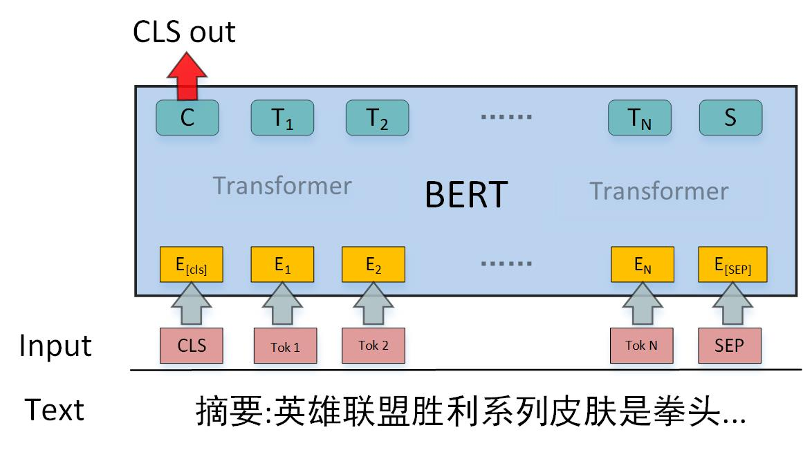
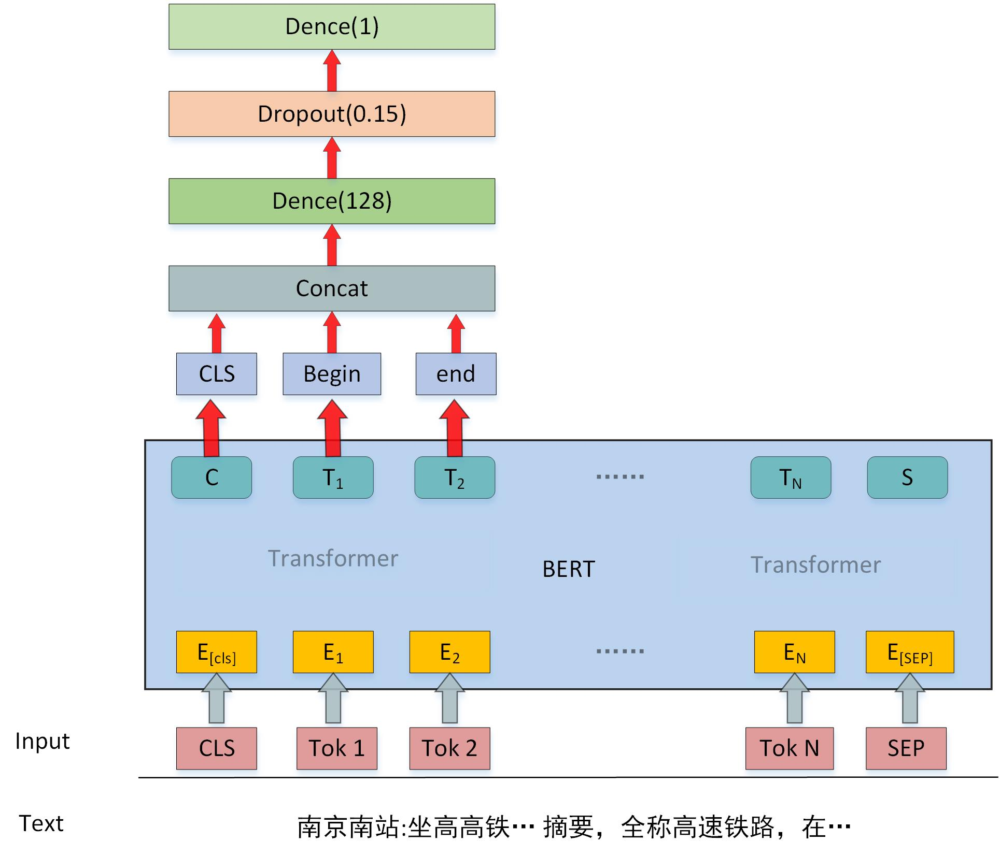

### <center>**CCKS&百度 2019中文短文本的实体链指 第一名解决方案**

   队伍：FREE 
   
   潘春光 panchunguang@126.com
   
   党金明 776039904@qq.com
   
   杨智 1780041410@qq.com
   
   郭旭炀 943024256@qq.com

code 文件夹下为项目文件
 比赛网址： https://biendata.com/competition/ccks_2019_el/
 数据集：https://pan.baidu.com/s/1SShtugdAMVf0fdaBowtMiA 提取码:8r80
 这是提交的时候代码，自己测试是请先划分出验证集，上述所有代码都是交叉验证有多个模型，很费时间，自己跑的时候跑一折就行
 

**摘要**

　　传统的实体链接任务主要是针对长文档。长文档拥有充分的上下文 信息，能够辅助实体的识别与消歧。相比之下，中文短文本的实体链接存 在很大的挑战。实体链接整个过程包括实体识别和实体消歧两个子任务。 针对实体识别子任务，我们创新性地利用了知识库描述文本的信息来增强 实体识别的性能，提出了 BERT-EntityNameEmbedding（BERT-ENE） 模型。具体地说，首先通过挖掘知识库中实体的描述文本得到实体名字的 向量嵌入，然后通过名称字典匹配技术，得到得到短文本中的候选实体，最 后利用 BERT-ENE 模型对结果进行筛选，完成实体识别的任务。此外，本 文进一步提出了一种将 BERT-ENE 模型与 BERT-CRF 模型相融合的新 方法，相比传统方法识别效果有了显著提升。针对实体消歧子任务，将其 视为二分类问题，通过基于 BERT 的二分类模型对候选实体进行预测，然 后对预测的概率进行排序，进而完成消歧任务。基于本文提出的方法，我们在 CCKS2019 面向中文短文本的实体链指任务中，取得了第一名的成绩。

**关键词**

　　实体链接，实体识别，实体消歧，BERT

**1** **数据分析与处理**

　　训练数据包含 text 字段和 mention_data 字段，mention_data 里面包 含连接的 mention 以及 kb_id。知识库包含 subject_id，subject，alias，data 等字段，data 中包含多个 predicate、object。

**1.1 引入新的别名**

　　经过对数据集统计分析，训练集中有 2.592% 的实体名在实 体库中无法匹配，部分错误样例如下所示： 

1. 安妮 ‘海瑟薇：文本中间有特殊符
2. 新浪微薄：输入文本中实体名错误
3. 国家质检总局: 别名不在知识库中

　　为了解决这个问题通过为知识库中的对应实体引入新的别名来改善这 一问题，具体步骤如下

1. 对于错误１，对特殊符号进行归一化处理，并将处理后的名字，加入到对应实体的别名中。如所有中文标点符号全部准换成英文标点符号。

2. 对于错误３，我们实体识别的模型能够解决这一问题

3. 针对错误2与错误3，统计知识库中实体（$E$）无法匹配总次数（$E_{num}$）,训练集中实体E 无法匹配的所有字符串（$M_1,M_2,M_3...M_i$）以及该字符串对应的出现次数（$M_{inum}$）。我们设定，如果$E_{num}$ 大于4，并且$M_{inum}$ 大于3，则将字符串M加入到实体E的别名中。如，针对知识库中实体 bilibili 统计信息如下：

   ```python
   'bilibili':{'E_num': 108, '哔哩哔哩': 94, '哔哩哔哩弹幕视频网': 5, '异地恋': 1, 'b站': 8}
   ```

   根据以上统计将 '哔哩哔哩' ，'哔哩哔哩弹幕视频网'，'b站' 加入到实体 bilibili 的别名中。

**1.2  实体描述文本的构建**

　　知识库中每个实体都有‘data’ 字段，‘data’ 字段包含多个predicate项和object项，数据格式如下：

```json
"subject_id": "10001"
"subject": "胜利",
"data": [
    {"predicate": "摘要", "object": "英雄联盟胜利系列皮肤是拳头公司制作的具有纪念意义限定系列皮肤之一。拳头公司制作的具有纪念意义限定系列皮肤还包括英雄联盟冠军系列皮肤。..."}, 
    {"predicate": "制作方", "object": "Riot Games"}, 
    {"predicate": "外文名", "object": "Victorious"},
    {"predicate": "义项描述", "object": "游戏《英雄联盟》胜利系列限定皮肤"}]
```

　　将所有的 predicate和object 相连得到实体描述文本。

```json
{"10001": "摘要：英雄联盟胜利系列皮肤是拳头公司制作的具有纪念意义限定系列皮肤之一。...,制作方:Riot Games,外文名:Victorious,来源:英雄联盟,中文名:胜利" }
```

　　连接后的描述文本长度分布如下：

<center>

</center>

　　通过分析可以发现文本会存在过长的情况，为了方便以后处理需要多过长的文本进行截断，截断规则如下：

1. predicate项+object项 的长度小于30 不截断
2. predicate项+object项 的长度大于30按比例截断

**1.3 其他处理**

 　　为了方便后续模型的使用我们需要根据知识库数据，构建一些字典。有以下几个字典：

1. entity_id 字典   key：实体名字 value：kb_id 列表

   ```python
   {'胜利': ['10001', '19044', '37234', '38870', '40008', '85426', '86532', '140750']}
   ```

   其中 胜利 为实体名字，列表里面为名字为 胜利 的所有实体的id。

2. id_entity字典  key: kb_id  value: subject字段(实体名字)

   ```python
   {'10001': '胜利'}
   ```

3. id_text字典 key：kb_id   value: 实体描述文本

   ```python
   {'10001': '摘要:英雄联盟胜利系列皮肤是拳头公司制作的具有纪念意义限定系列皮肤之一。'}
   ```

4. id_type字典  key：kb_id    value: entity type

   ```python
   {'10001': ['Thing']}
   ```

5. type_index字典 key：type name value：index

   ```python
   {
       ‘NAN’: 0
       'Thing':1
   }
   ```

**2 实体识别**

 　　但是使用 BERT-CRF模型只利用到了短文本信息，并没有利用知识库的信息。仍然会遇到实体边界识别错误，句子中实体识别不全等问题。为了解决上述不足，并且能够完全利用知识库的信息，提出了 BERT-ENE 模型。

针对实体识别任务，首先采用现在效果较好的 BERT-CRF 命名实体识别模型。针对基于实体库实体链接（尤其是短文本）仅仅采用BERT+CRF进行实体识别有两点不足：

1. BERT+CRF仍然会造成实体边界错误
2. BERT+CRF模型识别实体不全
3. 没有利用到知识库的信息

为了解决上述两个不足，并且能够完全利用知识库里面的实体信息，构建了BERT-EntityNameEmbedding模型，与BERT-CRF融合，解决上述问题。

**2.1 BERT+CRF**

 　　图 1 为 BERT-CRF 模型，采用 BIO 标记，其中 BERT 的[CLS],[SEP] 位置用标签 TAG 表示。模型主要包含输入层、 BERT 层和 CRF层。：

<center>

</center>

涉及到的一些参数:

-- max_len 52

--batch_size 64

--dropout 0.2 （bert 输出后接的dropout）

--num_epochs 7

一些训练细节：

1. 将训练集分为9份，采用9折交叉验证，分别按照loss和f1保存模型，共18个模型
2. 因为BERT具有一定的随机性，在训练的过程中针对每个模型会多训练几次选择较好的一个（从第一轮结束验证后就能判断，不用全部跑完）
3. 前3轮学习率为1e-5，后面会调整为1e-6
4. 最大epoch为7，训练过程会根据loss提前停止

**2.2 BERT-EntityNameEmbedding（BERT-ENE）模型**

　　BERT-ENE 模型如图 2 所示，其具体思路为： 1. 利用知识库的实体名称和实体的别名信息构建实体名称字典。 2. 通过知识库的实体描述文本，利用 BERT 预训练模型，选取模型 CLS 位置的向量输出作为实体名称的
向量嵌入。 3. 通过字典匹配方式，得到短文本中候选实体。 4. 通过构建的BERT-ENE 模型对匹配的结果进行筛选。

**2.2.1 字典树+实体正向最大匹配**

　　为了加快速度采用字典树这一结构，同时采用正向最大匹配实体的思路，去匹配文本中实体。首先需要的数据为1.3中的 entity_id 字典，将里面的key 也就是实体名字插入到字典树中，实体库中存在很多单字实体，这类实体匹配会造成太多匹配结果，对于单字实体不在插入。

全部匹配例：

```python
text：《大话英雄·联盟》-原创-高清视频
result： [('大话英雄·联盟', 1), ('联盟', 6), ('原创', 10), ('高清视频', 13), ('视频', 15)]
```

最大匹配例：

```python
text：《大话英雄·联盟》-原创-高清视频
result： [('大话英雄·联盟', 1), ('原创', 10), ('高清视频', 13)]
```

正确结果：

```python
text：《大话英雄·联盟》-原创-高清视频
result： [('大话英雄·联盟', 1), ('视频', 15)]
```

通过经过统计发现，采用最大匹配对整体数据效果较好，但是在实验过程中发现，最大匹配时会出现一些实体重复，如 迅雷、下载 和 迅雷下载三个实体，还有 视频 和 高清视频两个个实体，如果不处理最大匹配时将会漏掉 迅雷、下载 两个实体，仅仅会匹配 迅雷下载 这一个实体。为处理这种情况，统计他们出现的次数并根据出现次数来决定这类实体该怎么处理。处理分一下三种情况：

```
  1. 仅保留最大的实体，如迅雷下载开，
  2. 保留小的实体，具体保留那个看统计数据 如  迅雷、下载 仅仅保留‘迅雷’
  3. 都保留 如 迅雷 下载 迅雷下载
```

代码实现依然按照最大匹配去实现，只是针对要分开的实体，在匹配结束后再分开。

**2.2.2 实体名字嵌入**

　　为了能够对匹配到的实体进行二分类，需要将实体名字用一个向量表示，当然实体名字嵌入向量可以随机生成最后通过训练也能不断拟合，但是一个好的初始化向量对结果影响很大，也因为后续模型用到了BERT，这里使用BERT来得到实体名字的嵌入。具体思路和过程如下：

1. 将每个实体文本描述输入到BERT模型，则 [CLS] 位置的输出向量可以这个实体的意思。于是我们能够得到每个实体对应的向量，代码中我们用一个字典表示 id_embedding key：subject_id， value：CLS 输出向量

2. 对于实体名字只对应一个实体的情况，则直接用实体对应向量当做这个实体名字的嵌入。如

   ```python
   {'无尽武道': ['10007']}
   ```

3. 对于实体名字只对应多个实体的情况，求平均，如

   ```python
   {'胜利': ['10001', '19044', '37234', '38870', '40008', '85426', '86532', '140750']}
   ```

通过这种方式能够为每个实体名字得到一个768维的向量嵌入，模型图如下：

<center>

</center>

**2.2.3 训练数据构建**

通过上述匹配方式，匹配结果：（高清视频 属于上述第三种情况，最后模型会判断取那个好）

```python
text：《大话英雄·联盟》-原创-高清视频
result： [('大话英雄·联盟', 1), ('原创', 10), ('高清视频', 13), ('视频', 15)]
```

根据正确结果得到 label 为：

```python
label = [1,0,0,1]
```

**2.2.4 模型**

BERT-ENE 模型如图 2 所示，其基本思路为：

1. 利用知识库的实体名称和实体的别名信息构建实体名称字典。
2. 通过知识库的实体描述文本，利用 BERT 预训练模型，选取模型 CLS 位置的向量输出作为实体名称的
   向量嵌入。 
3. 通过字典匹配方式，得到短文本中候选实体。 
4.  通过构建的BERT-ENE 模型对匹配的结果进行筛选。

<center>

</center>

模型具体过程为：

1. 短文本经过 BERT层 ，得到BERT的输出
2. 将BERT的输出输入到正向GRU网络和反向GRU网络中。然后抽取匹配到的实体名称对应在正向GRU的结束位置的向量$V_{end}$以及对应在反向GRU的开始位置的向量$V_{begin}$，将这两个向量连在一起得到$V_{con}$，则可以代表这个实体名称在文本语义表示。  
3. 为了学到整个文本的信息，分别对正向GRU 和反向GRU的输出，做最大池化操作，得到向量$V_{max}$，$V_{max}$可以表示整个文本的语义。 
4. 最后将$V_{max}$与$V_{con}$以及对应的实体名称嵌入连在一起经过卷积层、全连接层，$sigmoid$激活最后得到预测概率。 

**2.3 实体识别结果融合**

如上所述，实体识别分为两个模型，一个 BERT-CRF 模型，一个 BERTENE。 BERT-CRF 模型识别的实体会因为边界错误导致不能够匹配得到候选实体。而 BERT-ENE 模型是通过词典匹配方式实现，所以 BERT-ENE的结果都能够在知识库找到候选实体，不会出现边界错误。 BERT-ENE 模型在词典匹配时，去掉了单字实体，而 BERT-CRF 模型可以预测单字实体。所以将两种方案融合，能够取得最好的效果。融合规则为：如果两个结果在位置存在重复，则选取 BERT-ENE 的结果，单字实体选取 BERT-CRF 模型的结果。

具体为：BERT+CRF共18个模型，对预测结果进行投票，分别去BERT+CRF模型投票大于8的作为BERT-CRF 模型的结果。选取BERT-ENE模型概率大于0.45作为结果，合在一起即可。

**３实体消歧**

　　实体消歧是基于二分类的思想实现，训练时选取连接到的实体作为正例，在候选实体里选取两个负例。将短文本以及待消歧实体的描述文本连在一起，输入到BERT模型，取CLS 位置向量输出，以及候选实体对应开始和结束位置对应的特征向量，三个向量连接，经过全连接层，最后sigmoid激活得到候选实体的概率得分。对所有候选实体的概率得分进行排序，选择概率最高的为正确实体。模型图如下：

<center>

</center>

其他细节：

1. 两个句子长度最大选取为256，负样本选取了3个，并且选取了一些通过上述匹配方式得到的一些负样本
2. 训练集分为5份，5折交叉验证，并对测试集结果求平均
3. 后来发现时间充足又训练了，长度384，负样本选取了2个,7折交叉验证的模型，并与上面的求平均
